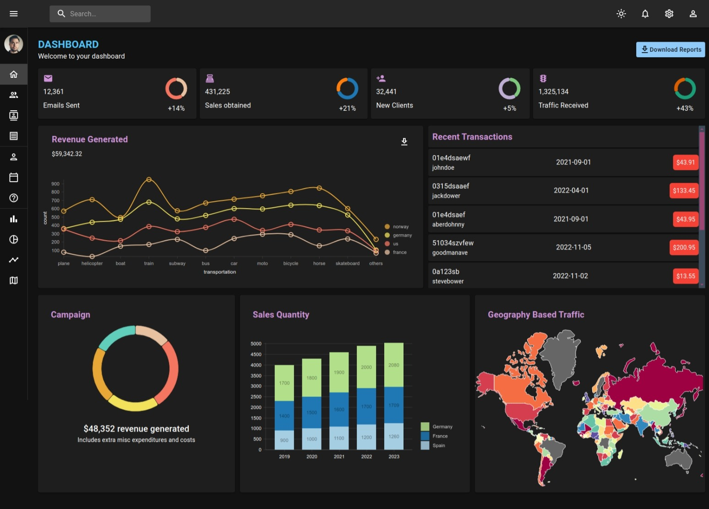

# Dashboard

## Overview
This project is a customizable and dynamic React.js dashboard application designed to visualize and manage data efficiently. It serves as an ideal solution for displaying real-time metrics, analytics, and interactive charts, making it highly suitable for applications such as admin panels, reporting systems, or project management tools. The project showcases your ability to build modern, responsive, and data-driven interfaces using React.



## 1. Tech Stack

- Framework: `React.js`
- Styling: `Material UI`
- Form: `React Hook Form`
- Router: `React Router DOM`


## Getting Started

To get a local copy of the project up and running, follow these steps:

```bash
git clone https://github.com/mohamedelmougy/react-dashboard.git
npm i
npm run dev
```